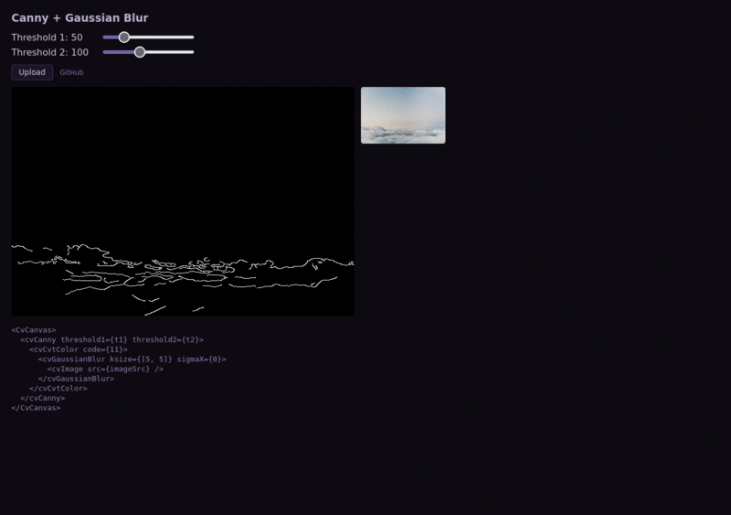
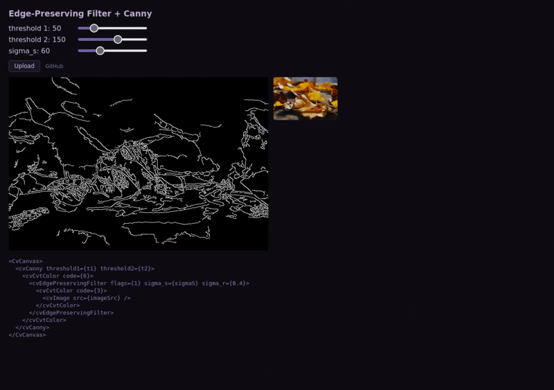
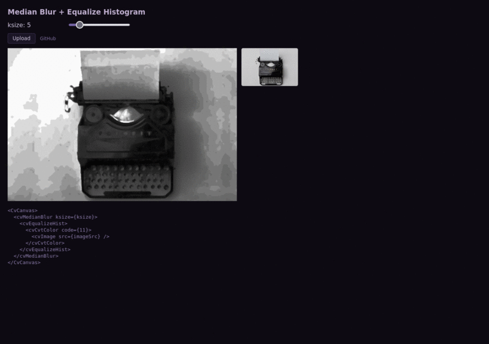

# react-opencv-fiber

[](https://www.npmjs.com/package/@react-opencv/fiber)

A React renderer for OpenCV.js. Write image-processing pipelines as JSX — each element maps to an OpenCV operation, and the tree executes bottom-up through a custom React reconciler.

[**Live demo**](https://erasta.github.io/react-opencv-fiber/)

```tsx
<CvCanvas>
  <cvCanny threshold1={50} threshold2={100}>
    <cvCvtColor code={11}>
      <cvGaussianBlur ksize={[5, 5]} sigmaX={0}>
        <cvImage src="photo.jpg" />
      </cvGaussianBlur>
    </cvCvtColor>
  </cvCanny>
</CvCanvas>
```

## How it works

The library uses a custom React Fiber reconciler to build a tree of `CvNode`s from JSX. When the tree changes (props update, nodes added/removed), the pipeline re-executes:

1. **Leaf nodes** (`<cvImage>`) load source images into OpenCV `Mat` objects
2. **Inner nodes** (`<cvGaussianBlur>`, `<cvCanny>`, ...) receive their child's `Mat` as input, apply the corresponding `cv.*` function, and pass the result up
3. **`<CvCanvas>`** displays the final `Mat` on an HTML canvas

Intermediate `Mat` objects are automatically cleaned up to avoid WebAssembly memory leaks.

## API

### `<OpenCVProvider>`

Loads OpenCV.js (WASM, ~8 MB) and provides it via context. Wrap your app with this.

```tsx
<OpenCVProvider>
  <App />
</OpenCVProvider>
```

### `useOpenCV()`

```tsx
const { cv, loading, error } = useOpenCV();
```

### `<CvCanvas>`

Renders a `<canvas>` and executes the CV pipeline defined by its children.

```tsx
<CvCanvas
  style={{ maxWidth: "100%" }}
  className="my-canvas"
  onResult={(mat) => { /* final Mat before display */ }}
>
  {/* CV operation tree */}
</CvCanvas>
```

Supports `ref` forwarding to the underlying canvas element.

### CV operation elements

Any OpenCV function can be used as a JSX element with a `cv` prefix:

| JSX element | OpenCV function |
|---|---|
| `<cvGaussianBlur ksize={[5,5]} sigmaX={0}>` | `cv.GaussianBlur(...)` |
| `<cvCanny threshold1={50} threshold2={100}>` | `cv.Canny(...)` |
| `<cvCvtColor code={11}>` | `cv.cvtColor(...)` |
| `<cvThreshold thresh={127} maxval={255} type={0}>` | `cv.threshold(...)` |
| `<cvResize dsize={[320, 240]}>` | `cv.resize(...)` |
| `<cvMedianBlur ksize={5}>` | `cv.medianBlur(...)` |
| `<cvBilateralFilter d={9} sigmaColor={75} sigmaSpace={75}>` | `cv.bilateralFilter(...)` |

Operations are nested inside-out — the innermost element runs first:

```tsx
// Execution order: image load -> blur -> grayscale -> edge detection
<cvCanny threshold1={50} threshold2={100}>
  <cvCvtColor code={11}>
    <cvGaussianBlur ksize={[5, 5]} sigmaX={0}>
      <cvImage src="photo.jpg" />
    </cvGaussianBlur>
  </cvCvtColor>
</cvCanny>
```

Props map directly to OpenCV function parameters. Array values are coerced to the appropriate OpenCV types (`Size`, `Point`, `Scalar`).

### `<cvImage>`

Special element that loads an image (URL or data URI) into a `Mat`.

```tsx
<cvImage src="https://example.com/photo.jpg" />
```

## Examples

The `examples/` directory contains interactive demos with different filter combinations. [**Live demo**](https://erasta.github.io/react-opencv-fiber/)

<p>
  
  
</p>
<p>
  
  
</p>
<p>
  
</p>

To run locally:

```sh
npm install
npm run build
cd examples && npm install && npx vite
```

## Acknowledgements

- [OpenCV](https://opencv.org/) — the computer vision library that powers all the operations
- [OpenCV.js](https://docs.opencv.org/4.x/d5/d10/tutorial_js_root.html) — the JavaScript/WebAssembly port of OpenCV
- [React Three Fiber](https://github.com/pmndrs/react-three-fiber) — the inspiration for using a custom React reconciler to drive a non-DOM library

## License

[MIT](./LICENSE)
